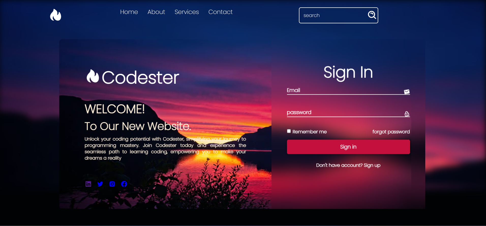

# codester

# Codester - Your Coding Companion

## Description

Welcome to Codester, your ultimate coding companion! This project aims to provide a seamless coding experience and support for developers of all levels. With a wide range of features and functionalities, Codester empowers you to boost your coding productivity and take your projects to the next level.

**Key Features:**
- Access to a library of code snippets and templates
- Customizable coding environments for various languages
- In-depth documentation and community support

## Installation

To get started with Codester, follow these simple steps:

1. Clone this repository: `git clone https://github.com/Ranaiiest/codester.git`
2. Navigate to the project directory: `cd codester`
3. Install dependencies: `npm install`
4. Start the development server: `npm start`

Feel free to explore, contribute, and elevate your coding experience with Codester!

## Demo

Check out the live demo [here](https://ranaiiest.github.io/codester/).

## Contributing

Contributions are always welcome! If you have any ideas or improvements, please feel free to submit a pull request.

